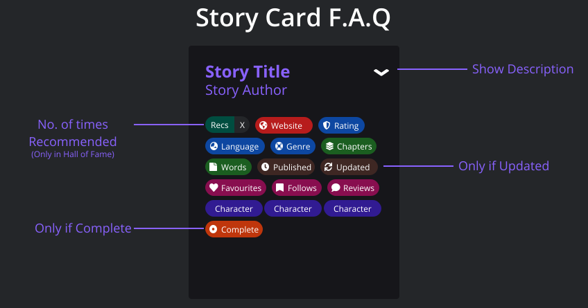

# HPFFREC-NEXTJS
Frontend code for [HPFanfiction Recommender](https://hpffrec.hackesta.org/) webiste. Written in NextJS

## How it works?
[trigger-backend](.github/workflows/trigger-backend.yml) triggers a Python Backend every two hours. The backend uses [pushshift.io](https://pushshift.io) to lookup comments made by [FanfictionBot](https://github.com/FanfictionBot/). It parses the comments and stores the data in a database. It then generates a bunch of JSON files requrired by this frontend.
After finishing, it triggers the website build over at [Vercel](https://vercel.com/).

The frontend requests all the necessary JSON files at build time using `getStaticProps()` and builds the website.

The description of the stories are fetched at client side using [SWR](https://swr.vercel.app/)

## F.A.Q

## STATS
